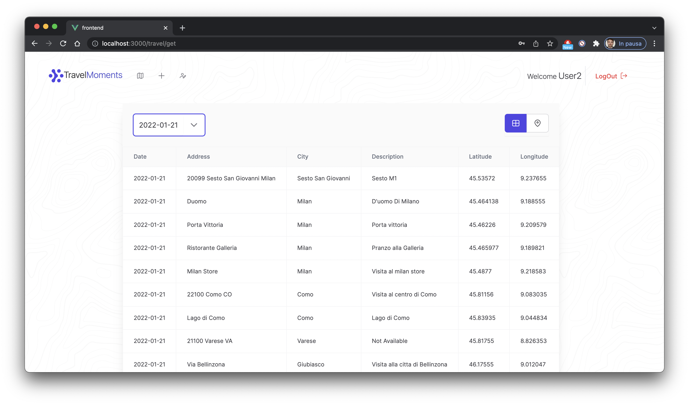
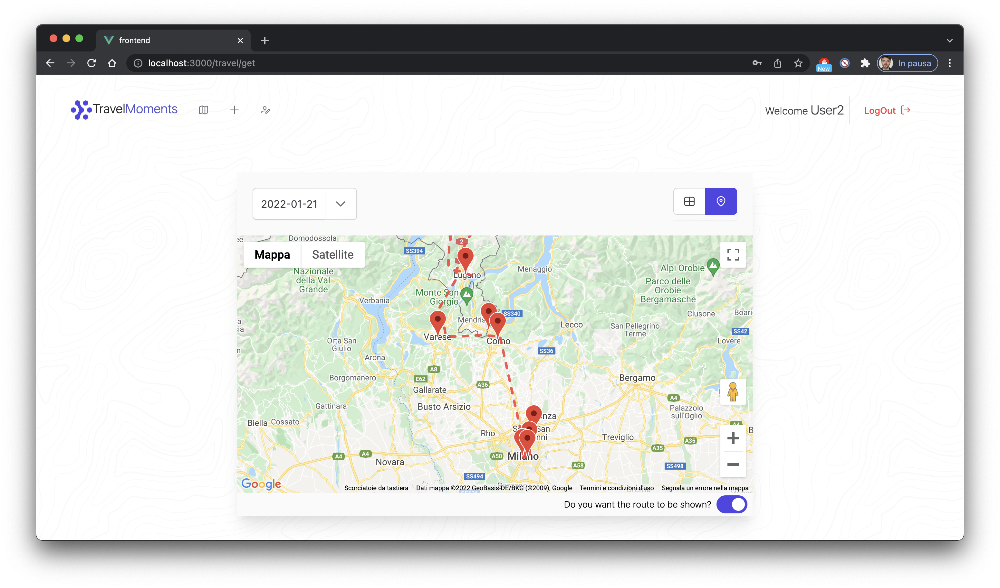

# TravelMoments Web App
This web app was created for the exam of web development course provided by University of Trieste.
TravelMoments is a web-app to record travel routes and places.

The application will allow a registered user to store the information related to their travels in order to view them later. The users, who will have to authenticate themselves on the platform, will be able to save the information related to their travels such as the route taken, the places visited, the means of transport used and the dates of the trip. In addition, it will be possible to view this information and modify it later.

#Main functions
##Viewing travels
A user can view his daily travels. The visualization page presents a menu from which to choose a date and, according to the chosen date, shows the travels made in that day. The travels will be visualized on a map (google maps style), highlighting the main stages with a pin. Moreover, under the map, a summary table of the places visited during the day will appear.

##Inserting travels
The user can insert a new trip. To do so, he will have access to a dedicated page where he will enter the information related to a trip. These will be:
Date
Vehicle used
Route taken, that is the geographical coordinates of the trip (if desired, the GeoJSON format can be used, optional)
Main places

##Modify existing travels
Same interface as for inserting new travels, but used to modify an existing travels.

##New user registration
A new user must be able to register through a special publicly accessible page. Each user is required to provide a username, password and email address.






# Backend
##Setup MongoDatabase
To import the dumped database:
````
cd mongo_database_dump
mongorestore -d progrweb dump/progrweb
````

OR

To create a new database with MongoDB
````
mongosh
````

Create a new database "progrweb"
```
use progrweb
```

Insert the necessary setup collection via mongosh:
```
db.createCollection("roles")
db.createCollection("travels")
db.createCollection("users")
db.createCollection("places")
db.roles.insertMany([
   { name: "ROLE_USER" },
   { name: "ROLE_ADMIN" },
])
```


##Start Backend jar
````
cd backend/target
java -jar backend-0.0.1-SNAPSHOT.jar
````


#Frontend

##Project setup

```
cd frontend
npm install
```

```
npm run serve
```

##User already presents on the DB

1. User1
````
Username : User1
Password : user123
````

2. User2
````
Username : User2
Password : user123
````