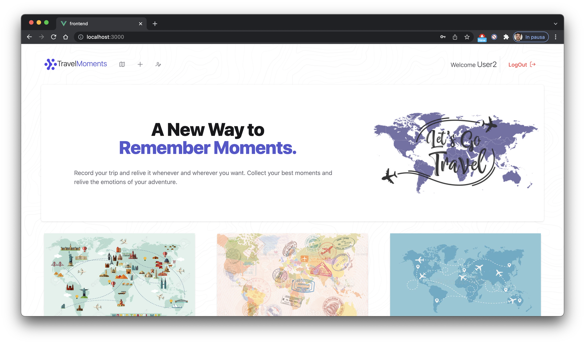
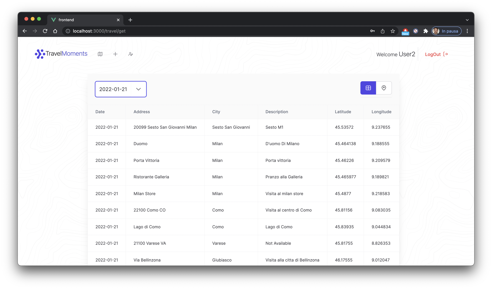
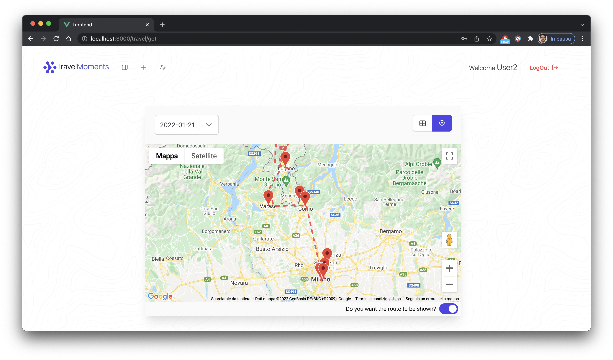

# TravelMoments Web App
This web app was created for the exam of web development course provided by University of Trieste.
TravelMoments is a web-app to record travel routes and places.







# Backend
###Setup MongoDatabase
To import the dumped database:
````
cd mongo_database_dump
mongorestore -d progrweb dump/progrweb
````

OR

To create a new database with MongoDB
````
mongosh
````

Create a new database "progrweb"
```
use progrweb
```

Insert the necessary setup collection via mongosh:
```
db.createCollection("roles")
db.createCollection("travels")
db.createCollection("users")
db.createCollection("places")
db.roles.insertMany([
   { name: "ROLE_USER" },
   { name: "ROLE_ADMIN" },
])
```


###Start Backend jar
````
cd backend/target
java -jar backend-0.0.1-SNAPSHOT.jar
````


# Frontend

## Project setup

```
cd frontend
npm install
```

```
npm run serve
```

## User already presents on the DB

1. User1
````
Username : User1
Password : user123
````

2. User2
````
Username : User2
Password : user123
````